[email](mailto:balachandran200707@gmail.com)

> CS-minded builder, shipping across web, native, and AI agent tooling. 
> Deterministic logic does the heavy lifting; GenAI stays on a short leash.

Lately that's [Synapse](https://github.com/7-Bala/Synapse) — an execution 
environment for tracing deterministic multi-agent runtimes — and 
[AnyGate](https://github.com/7-Bala/AnyGate), an accessibility-first wayfinding 
assistant built around one rule: the LLM explains, it never decides.

<samp>typescript &nbsp; python &nbsp; javascript &nbsp; swift &nbsp; react &nbsp; next.js &nbsp; tailwind &nbsp; docker &nbsp; git</samp>

**[BloopDocs](https://github.com/7-Bala/BloopDocs)** &nbsp;·&nbsp; <samp>typescript, next.js, docker</samp> 
Free document conversion platform on Next.js 16, powered by a headless 
LibreOffice engine — docx, xlsx, pptx, and PDF, converted either way.

**[Synapse](https://github.com/7-Bala/Synapse)** &nbsp;·&nbsp; <samp>python, typescript</samp> 
An execution environment and debugger for deterministic multi-agent runtimes. 
Traces reasoning, evidence, and consensus loops in real time, not static metrics.

**[AnyGate](https://github.com/7-Bala/AnyGate)** &nbsp;·&nbsp; <samp>javascript, gemini</samp> 
Accessibility-first wayfinding for stadium-scale events. A deterministic engine 
filters and ranks routes; the LLM's only job is explaining the recommendation.

**[ClaudePet](https://github.com/7-Bala/ClaudePet)** &nbsp;·&nbsp; <samp>swift, appkit</samp> 
A pixel-art mascot on the macOS Dock that reacts in real time to a running 
Claude Code session — jumps on tool calls, waves when it needs input.

Every graphic here is generated, not embedded from anyone else's server. 
`ascii.svg` — the compass — is drawn by 
[`scripts/make_wordmark.py`](scripts/make_wordmark.py): the bezel draws itself 
in, the needle spins and settles like it's found a direction, then the word 
wipes in. The stat graphics and these section headings are drawn by 
[a scheduled action](.github/workflows/stats.yml) straight from the GitHub 
GraphQL API, once a day, committing only what changed.

They animate with SMIL inside the SVG, because GitHub strips scripts from 
READMEs — and since nothing loads from a third party, nothing here can 
rate-limit or go dark. The headings are SVGs for the same reason: GitHub also 
strips CSS, so an image is the only way to put this page's own typeface on them.

Two typefaces are inlined as base64, since an external font URL can't work 
here — the SVGs load through ``, and browsers refuse subresource fetches 
for image documents. [JetBrains Mono](scripts/fonts) draws the data graphics 
and headings; [Fredoka](scripts/fonts/fredoka-explore.woff2) sets the word 
under the compass, subset to just the letters it spells. The compass face 
itself is plain SVG shapes, no font involved.

Language totals cover public repositories only. `year.svg` uses the same 
character ramp: `:` `+` `#` `@`, quiet to loud.
